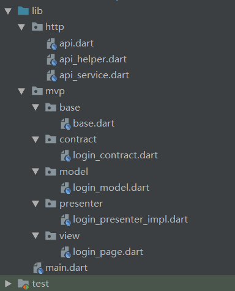

# flutter_quick_mvp
#### gitee: https://gitee.com/xiaoqinghong/flutter_quick_mvp
#### github: https://github.com/xiaoqinghong/flutter_quick_mvp
Flutter这个跨平台的解决方案先在正发展的火热，最为Android(搬)开(砖)发(的)，自然是想要了解了解。
flutter_quick_mvp是一个自己YY的工程结构的想法，之前用Android模板做过[Kotlin版本的MVP](https://github.com/xiaoqinghong/AndroidQuickMVP)
## Dio+MVP
flutter开发中常用的网络请求框架Dio，在这也是用的这个框架。对于MVP的解释我就不啰嗦了，网上到处都能搜到。M(model)、V(view)、P(presenter)。该工程根目录下有个mvp.dart的文件，将会用这个文件来生成对应的mvp代码。
## 操作起来
1. 下载该项目
2. 将lib/http加入的你的工程中
3. 在lib下创建文件夹，结构：```lib/mvp/base```
4. 将工程中的```lib/mvp/base/base.dart```加入到工程对应目录下
5. 将mvp.dart放到你的根目录，打开mvp.dart
```
// 这里可以替换成自己的包名
const package = "flutter_quick_mvp";
```
## 效果
比如想要创建一个登录页面，在工程根目录下执行（前提是你的flutter和dart的环境已经配置好了）
```
dart mvp.dart login
```
"login"指的是创建的页面的名字，例如我要创建一个设置页面可以这样操作
```
dart mvp.dart app_setting
```
- 如图所示

- 然后就可以看到工程中生成了mvp结构和一些.dart文件

## http模块
###### *lib/http/api.dart
这个文件只存放接口地址，例如在该工程中
```
class Api {
  static const String USER_LOGIN = "v2/star/login";
}
```
###### *lib/http/api_helper.dart
这个文件是对Dio的简单封装，一个单例暴露了get和post两个方法
```
void get(String url,
    [Map<String, dynamic> params,
    void onSuccess(Response response),
    void onError(Exception e)]) {
}

void post(String url,
    [Map<String, dynamic> params,
    void onSuccess(Response response),
    void onError(Exception e)]) {
}
```
###### *lib/http/api_service.dart
这个文件里是一个```abstract```类，每个```model```都会继承它，比如刚才创建的```login_model.dart```。它的主要作用是做一些http成功(把response转换成需要的结果)或失败(把异常"翻译"成人话)的一些回调处理。
```
typedef ServiceSuccessCallBack = void Function(Map<String, dynamic> data);
typedef ServiceErrorCallBack = void Function(String msg);

abstract class ApiService {
  void proxySuccessCallBack(Response response,
      ServiceSuccessCallBack callBack) {
    if (callBack != null) {
      try {
        callBack(json.decode(response.toString()));
      } catch (e) {
        print("callBackErr: $e");
      }
    }
  }

  void proxyErrorCallBack(Exception e, ServiceErrorCallBack callBack) {
    if (callBack != null) {
      callBack(_parserException(e));
    }
  }
}
```
###### *lib/mvp/contract/
该目录下的文件用于约定view和presenter间的依赖关系（契约），存放view和presenter中需要被互相调用的方法。
###### *lib/mvp/presenter/
model和view间的中间商，例如登录，在页面中点击一个button发起登录，view<--->presenter<--->model。这一层的作用是将请求传递给model处理，在得到结果后，把结果按照页面需要的形式交给页面做处理。
###### *lib/mvp/model/
背后里默默付出的苦逼骚年，只负责对接数据源（http、db......)并由presenter随意调用其函数。还是以登录接口为例，它继承了ApiService，与ApiHelper对接，请求数据，将结果（失败或成功）进行简单的处理，通过函数回调。这层不与presenter绑定的原因是，不绑定，则任何presenter都可以调用它的函数，减少冗余代码。
```
class LoginModel extends ApiService {
  void userLogin(String phone, String password, String code,
      ServiceSuccessCallBack callBack,
      [ServiceErrorCallBack errorCallBack]) {
    ApiHelper.instance.post(
        Api.USER_LOGIN,
        {"phone": phone, "password": password, "code": code},
        (response) => proxySuccessCallBack(response, callBack),
        (exception) => proxyErrorCallBack(exception, errorCallBack));
  }
}
```
###### *lib/mvp/view/
这一层只管貌美如花就行了，脏活累活只管交给小弟（presenter）去做就行了。
## 网络乞丐环节
希望可以骗你点个赞T_T。